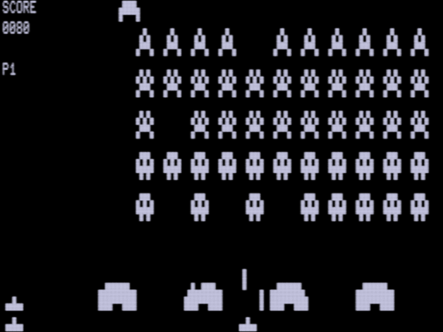
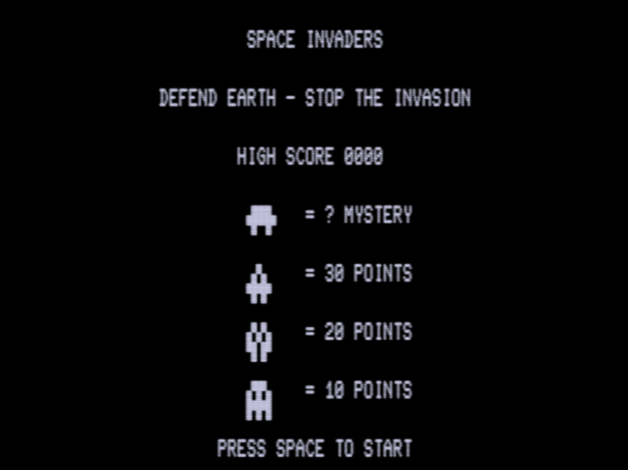
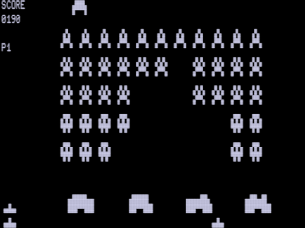

# TRS-80 Space Invaders

A faithful Space Invaders for the TRS-80 Model I and Model III, written in Z80
assembly. Runs on real hardware and in the [trs80gp](http://48k.ca/trs80gp.html)
emulator.



## Features

- Full 5×11 invader formation with pixel-wise (not character-wise) marching and
  descent, flicker-free rendering on the 64×16 text screen
- Splash screen with arcade-style score table
- Mystery ship (UFO) with random 50–200 point bounty
- Four eroding shields with pixel-row erosion
- Per-kill speed-up — the last invader moves at ~14× the starting speed
- Wave progression: each wave starts lower and fires torpedoes 20% faster
- Sound: march bass loop, UFO blip, death sound (cassette port audio)
- Persistent high score across sessions (via `tools/play.py`)
- BREAK leaves the game cleanly — in-game back to the splash, splash back to DOS
- Bootable LDOS disks for both models in [`disks/`](disks/), also submitted to
  the [RetroStore](https://github.com/apuder/tpk)

| Splash | In game |
|---|---|
|  |  |

## Play

```bash
# recommended: wrapper with persistent high score
tools/play.py

# or run directly (Model III)
trs80gp -m3 space_invaders.cmd

# or boot the disk, which auto-starts the game
trs80gp -m3 disks/space_invaders_model3.dsk    # answer the date prompt: 07/16/82
trs80gp -m1 disks/space_invaders_model1.dsk
```

Arrow keys move, SPACE fires, BREAK quits — from the game back to the splash,
from the splash back to the DOS prompt. Don't use `-turbo` — the game paces
itself off the frame rate. `space_invaders.cmd` is the prebuilt binary and runs
unchanged on Model I (`-m1`) and Model III.

## Build

Assembled with [zmac](http://48k.ca/zmac.html):

```bash
zmac space_invaders.asm            # -> zout/space_invaders.cmd
cp zout/space_invaders.cmd .
```

`ORG` is `5500H` and should stay there. Not for the game's sake — it would run
just as happily at `5200H` — but because LDOS's `DUMP` command, which is how the
binary gets onto a disk (see below), **refuses to write anything below `5500H`**.
Its own overlay area lives down there.

## Rebuilding the bootable disks

`disks/` holds one LDOS image per model, each with `SPACEINV/CMD` on it and an
`AUTO` entry that starts the game straight after boot:

| | Model I | Model III |
|---|---|---|
| Size | 98'304 B | 193'024 B |
| Geometry | 35 tracks × 10 sectors, single density | 40 tracks × 18 sectors, double density |
| Why | the stock WD1771 cannot do double density | — |
| LDOS | 5.3.1 | 5.1.3 |

Both are JV3 (`.dsk`). Rebuilding them is only worth documenting because every
single step has a trap in it.

**The date prompt is not broken.** LDOS 5.1.3 is from 1982 and rejects any year
outside the eighties — silently, by re-prompting. It looks exactly like a dead
keyboard. Answer `07/16/82`.

**Model III — replace the binary with `DUMP`:**

```bash
trs80gp -m3 -d0 disks/space_invaders_model3.dsk -batch \
  -iw "Date" -id 150 -i "07/16/82\r" -iw "LDOS Ready" -id 80 \
  -i "KILL SPACEINV/CMD:0\r" -id 300 \
  -l zout/space_invaders.cmd -id 60 \
  -i "DUMP SPACEINV/CMD:0 (START=X'5500',END=X'6294',TRA=X'5500')\r" -id 500 \
  -i "AUTO SPACEINV\r" -id 300 -ix
```

Take `END` from the assembler listing, not from this README.

**Model I — do *not* use `DUMP` here.** LDOS 5.3.1 lacks the address guard that
5.1.3 has, so `DUMP` will load itself over the very memory it was asked to save
and write out its own remains. The symptom is a `SYS Error` on the next boot.
Copy the file from the Model III disk instead — the Model III's 1793 controller
reads single density, so both disks can be mounted at once:

```bash
trs80gp -m3 -d0 <model3.dsk> -d1 <model1.dsk> -batch \
  -iw "Date" -id 150 -i "07/16/82\r" -iw "LDOS Ready" -id 80 \
  -i "KILL SPACEINV/CMD:1\r" -id 300 \
  -i "COPY SPACEINV/CMD:0 SPACEINV/CMD:1\r" -id 600 -ix
```

**A disk that auto-starts never reaches `LDOS Ready`,** so `-iw "LDOS Ready"`
times out and every command after it is typed into the running game — silently.
Clear the `AUTO` entry first: it sits in the GAT sector, 16 bytes past the disk
name, CR-terminated. Overwrite its first byte with `0x0D` to disable it, and
re-issue `AUTO SPACEINV` when you're done.

**Verify positively — a run without an error message proves nothing.** Both
failure modes above are silent. Two checks, in this order:

1. The `DUMP` must actually print `Dumping: SPACEINV/CMD:0`. If that line is
   missing, nothing happened.
2. **Boot the disk and look.** This is the only check that covers everything.

Searching the image is a weak test, because `KILL` frees the granules without
wiping them — a hit may be the *old* build you just deleted:

```bash
grep -ac "INSPIRED BY SPACE INVADERS" disks/space_invaders_model3.dsk
```

It is still useful for the one question it answers honestly: whether a build
predating a given string is on the disk at all. (`-a` matters — without it
`grep` treats the image as binary and just exits 1.)

**Screenshots:** trs80gp defaults to `-va` ("authentic display") and bakes
scanlines and phosphor blur into `-ics` captures — 229 colours and ~50 KB of
CRT simulation. `-vi -v1` gives the raw pixel matrix the machine actually puts
out: 512×384 on Model III, 384×288 on Model I, two colours, under 1 KB.

```bash
trs80gp -m3 -batch -vi -v1 -id 1700 -ics -ix space_invaders.cmd
```

## The interesting part: byte-exact verification

This game was developed against two reference screenshots of the original it
recreates (`oldproj/StartGame.png`, `oldproj/StartGameOneMoveRight.png`).
Instead of eyeballing the screen, every change is validated by a pipeline that
proves the video RAM matches the targets **byte for byte**:

1. `tools/extract_grid.py` deterministically converts the reference PNGs into
   a 128×48 pixel matrix and the corresponding 64×16 character codes.
2. trs80gp runs headless (`-batch -turbo`), injects key presses through the
   keyboard matrix (`-ik`), and dumps raw text VRAM (`-it`) at precise frame
   counts.
3. `tools/verify.py` compares the dumps against the targets cell by cell.
4. `tools/validate_full.py` goes further: it detects the formation position on
   screen, reconstructs the *expected* full frame, and flags any residue pixel
   the incremental renderer left behind.

The 18 invader sprite variants (3 types × 2 animation states × 3 vertical
sub-positions) are not hand-drawn: `tools/gen_sprites.py` generates them from
the reference screenshots, which is what makes byte-exactness attainable.

## Architecture notes

- **One formation origin** (`FORM_COL/ROW/SUB/YSUB`) positions all 55 invaders —
  no per-invader address bookkeeping.
- `FORM_SUB` doubles as horizontal 1-pixel shift *and* animation state;
  `FORM_YSUB` gives 1-pixel vertical descent with character-row rollover.
- Sprites are blitted 5 characters wide with blank margins, so movement is
  self-cleaning: no erase pass, no flicker.
- Collision is resolved by screen peek plus back-calculation onto the
  formation slot.
- March speed comes from an 8.8 fixed-point speed table indexed by the live
  invader count, accumulated per frame.
- High score persistence abuses the printer port: on a new record the game
  prints `HSnnnn`, `tools/play.py` captures it and patches it back into the
  binary on next launch (works on Model I *and* III, which map the printer
  differently).
- The credits ticker on row 0 of the first splash models an endless strip of
  three copies of the message, each followed by 32 blanks: column *c* shows
  strip index `s - 64 + c`, so the text enters at the right edge and the gap
  falls out of the arithmetic instead of being counted. The row is composed in
  a RAM buffer and blitted with one `LDIR` — a partial row is on screen for
  ~0.7 ms, far too briefly for the beam to catch a half-shifted line. Its state
  is never initialised: `MARQ_S` and `MARQ_DONE` come from the load image as
  zero, which is why it runs on the first splash and no later one.
- Row 0 sits outside the verification zone (rows 1–15, columns 5–63), so the
  ticker cost nothing in byte-exactness.
- `BREAK` is bit 2 of the same keyboard row the game already polls (`3840H`).
  Leaving to DOS is `EI` + `JP 402DH`, the standard re-entry on both models.
